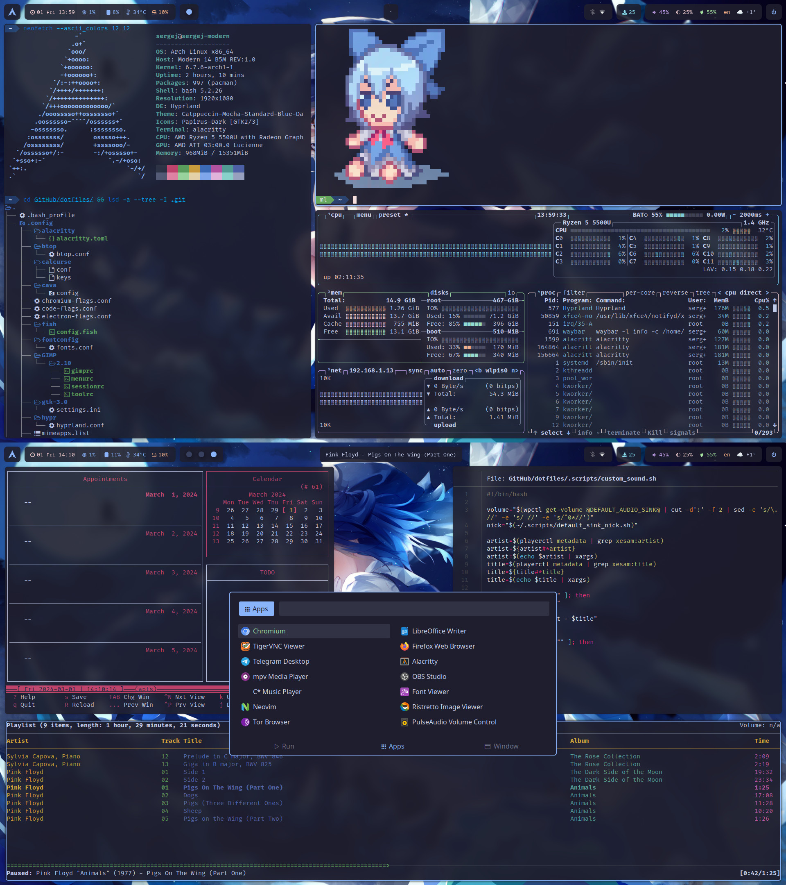

# xiyori's dotfiles

[](pic/)

```mint
⠀⠀   ⑨ Setup / Hyprland ⑨
 -----------------------------------

 ╭─ Distro  -> Arch Linux x86_64
 ├─ Editor  -> NeoVim
 ├─ Browser -> Firefox /w Betterfox
 ├─ Music   -> Cmus
 ├─ Shell   -> fish
 ╰─ Resource Monitor -> Btop

 ╭─ Model -> Modern 14 B5M
 ├─ CPU   -> Ryzen 5 5500U @ 4.0GHz
 ├─ GPU   -> No :(
 ╰─ Resolution -> 1920x1080

 ╭─ WM       -> Hyprland
 ├─ Terminal -> Alacritty
 ├─ Launcher -> Rofi
 ├─ Theme    -> Catpuccin-Mocha-Blue-Dark
 ├─ Icons    -> Papirus-Dark
 ╰─ Font     -> Fira Code Nerd Font

```

<h1></h1>

https://github.com/xiyori/dotfiles/assets/111375905/c208ef6b-5c20-4b28-8d38-18afbd212ff2

## Before installation

Please, check the install script before running it. The script is intended for clean base systems, installing it in a working setup is **not** recommended!

If you wish to install optional packages, edit your `/etc/pacman.conf` to include `multilib` repo:

```
[multilib]
Include = /etc/pacman.d/mirrorlist
```

## Installation

Run `./install.sh` from the repo directory. Minimum requirements are `base`, `base-devel`.

## Touhou

To play Touhou games, install

`pacman -S wine-staging winetricks wine-mono lib32-mesa-libgl lib32-gnutls lib32-alsa-plugins lib32-libpulse lib32-openal vulkan-radeon lib32-vulkan-radeon gamescope`

and run games like this:

`WINEARCH=win32 gamescope -W 1920 -H 1080 -r 60 --expose-wayland -- wine $YOUR_GAME`

## Credits

Artwork:

* [nifu (200°F)](https://www.pixiv.net/en/artworks/84795129)
* [Tess](https://www.pixiv.net/en/artworks/81827899)
* [竹之輪ちくわ (Takeyukiwa Tikuwa)](https://www.pixiv.net/en/artworks/76702197)

Scripts and configs are from / based on [PROxZIMA](https://github.com/PROxZIMA/.dotfiles), [AmitGolden](https://github.com/AmitGolden/dotfiles), [rustybucketz30](https://github.com/rustybucketz30/dotfiles) dotfiles. Look up the exact attribution in each file.
